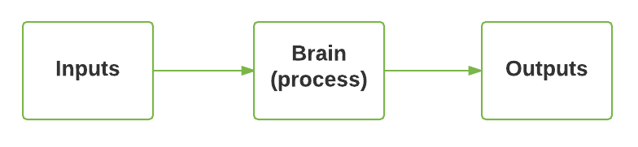
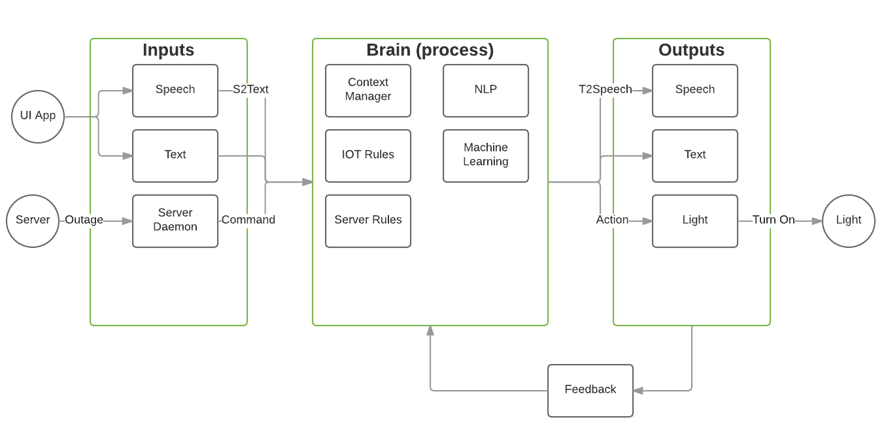
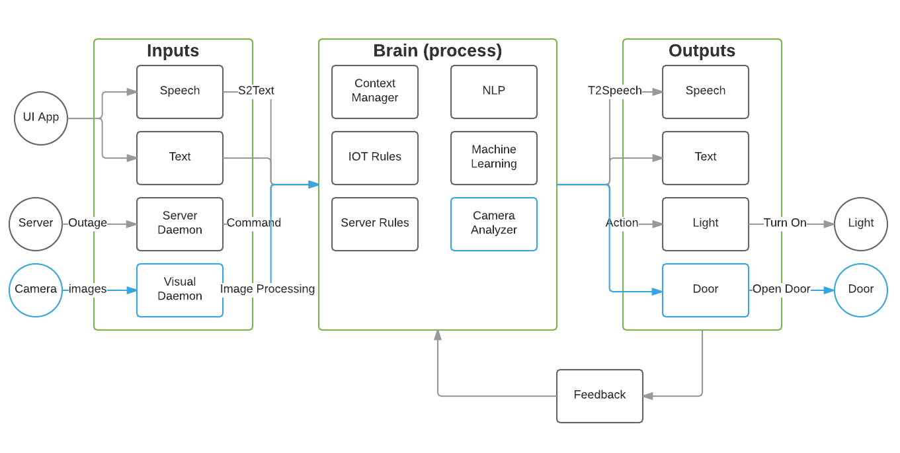

JARVIS [Digital Assistant]
=======

Project JARVIS [Digital Assistant] aims to build a comprehensive digital assistant echo system. 

We ambitiously aim to create JARVIS as a very intelligent system. Aim of this project is to explore true nature of an intelligent digital assistant that can continuously evolve by learning new things. 

Along the way, we will hopefully learn new technologies/concepts etc. and create a platform for future technologists looking to advance machine learning.

We will broadly incorporate following concepts into JARVIS's "BRAIN" and explore its behavior
<ol>
<li>Natural Language Processing (NLP)</li>
<li>Big Data and Machine Learning</li>
<li>IOT</li>
<li>Conversation Intelligence</li>
</ol>

(*As we move along, hopefully we can keep adding more concepts)

<h2>Introduction</h2>

Simply stated, a digital assistant should take information through input channels, process information in its brain and respond back through many forms of output
 <table>
	<tr>
		<td align="center">
			
		</td>
	</tr>
</table>

Inputs, brain and outputs will be composed of many components. Few examples
 
 
Inputs:
<ol>
<li>Speech (speak to JARVIS)</li>
<li>Text (type text to communicate with JARVIS)</li>
<li>Events 
	<ul>
	<li>Server Daemon (JARVIS should get event if server is down)</li>
	<li>Electric Cooker (JARVIS should get event if electric cooker left on for hours)</li>
	</ul>
</li>
</ol>
 
Brain:
<ol>
<li>Natural Language Processing (process input sentences to analyze)</li>
<li>Rules engine (understand semantics based on set of defined rules)</li>
<li>Machine learning (understand semantics based on its training data)</li>
<li>Context (JARVIS should keep track of context of dialogue to respond</li> appropriately)
</ol>
 
Output:
<ol>
<li>Speech (JARVIS should answer a question)</li>
<li>Text (text response to question)</li>
<li>Action 
	<ul>
    <li>Turn on light</li>
    <li>Restart server</li>
    </ul>
</li>
<li>Feedback (Response should be validated and sent back as feedback so JARVIS will continue to learn)</li>
</ol>
<table>
	<tr>
		<td align="center">
			
		</td>
	</tr>
</table>

As list of features will keep evolving, design of JARVIS should be modular and should accomodate addition of new features easily. As an example, in future JARVIS should be able to take visual information (security camera) and process that to respond with an output
<table>
	<tr>
		<td align="center">
			
		</td>
	</tr>
</table>

<h2>Technical Design</h2>

The project will be divided into 4 main components
<ol>
<li>inputs</li>
<li>brain</li>
<li>outputs</li>
<li>client (This will have UI components to interact with JARVIS)</li>
</ol>

<h2>Rules of Development</h2>
Since this is a complex project, we shall lay down some rules so we can build a consistent system. These rules are just to enforce standards so we can accomodate diverse technologies and development strategies. These rules are in no way best of breed. So please leave suggestions/feedback to improve development process!!!!

<ol>
<li>Each component will be made of a number of microservices, each service constituting a single function</li>
<li>Each microservice should expose api end points in JSON FORMAT</li>
<li>Service can be built in any desired language (I prefer Java, Groovy, Python)</li>
<li> All microservices should be fully tested before committing code. Code coverage will be tested</li>
<li> *Each microservice should define a configuration in its properties file indicating dependencies with other microservices. Dependencies should be grouped as CORE_DEPENDENCIES (microservice cannot function without these) and PARTIAL_DEPENDENCIES (microservice can serve partial features but not all features without these)</li>
<li> Goal is to deploy these services to cloud. So dockerize/containerize microservices in future</li>
</ol>